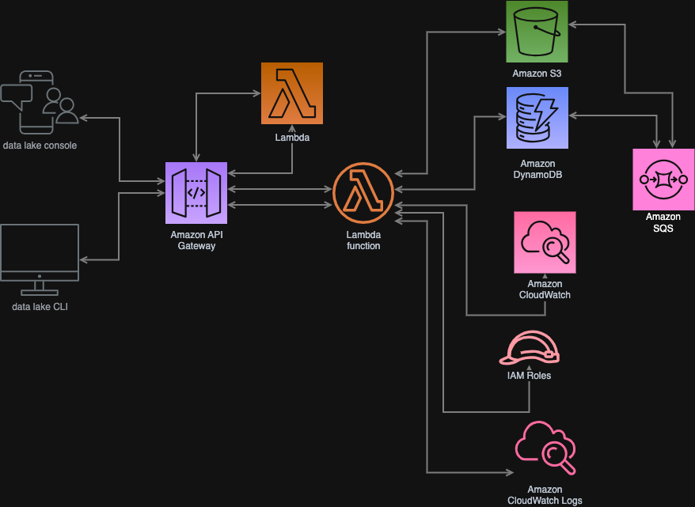

# Invoice Processing API

## Descrição
Esta é uma API para processamento de faturas em PDF. A aplicação extrai informações de arquivos PDF, armazena os dados no DynamoDB, faz upload do arquivo no S3 e envia mensagens para o SQS.

## Tecnologias Utilizadas
- **Node.js** com **Express** e *Typescript*
- **AWS S3** para armazenamento de arquivos
- **AWS DynamoDB** para armazenamento de metadados
- **AWS SQS** para gerenciamento de mensagens
- **Multer** para upload de arquivos
- **pdf-parse** para extração de dados
- **dotenv** para gerenciamento de variáveis de ambiente

## Instalação
### Requisitos:
- Node.js v22+
- AWS CLI configurado com credenciais adequadas

### Passos:
1. Clone este repositório:
   ```sh
   git clone https://github.com/thaissacarvalho/invoice-pdf.git
   cd invoice-pdf
   ```
2. Instale as dependências:
   ```sh
   npm install
   ```
3. Configure as variáveis de ambiente criando um arquivo `.env`:
   ```sh
   REGION=us-east-1
   BUCKET_NAME=seu-bucket
   TABLE_NAME=seu-dynamo-table
   SQS_URL=https://sqs.us-east-1.amazonaws.com/seu-queue-url
   ```
## Comandos da Aplicação
  
   1. Buildar a aplicação
  ```sh
   npm run build
   ```
   
   2. Iniciar a aplicação
   ```sh
   npm run start
   ```
   
   3. Testar a aplicação
   ```sh
   npm run test
   ``` 
   
   *Outros scripts da aplicação, por favor, leia o package.json*
   
## Endpoints
### Upload de Fatura
- **Rota:** `POST invoices/upload`
- **Descrição:** Faz upload de um arquivo PDF, extrai os dados e armazena no DynamoDB e S3.
- **Requisição:**
  - Form-data com um arquivo (campo `file`)
- **Resposta:**
  ```json
  {
    "id": "171234567890",
    "numeroInstalacao": "1234567890-1",
    "endereco": "Rua Exemplo, 12345678",
    "dataReferencia": "01/2024",
    "datasLeitura": {
      "anterior": "01/01/2024",
      "atual": "31/01/2024"
    },
    "totalPagar": "150.00",
    "itemsInvoice": ["Consumo de Energia", "Impostos"],
    "extraidoEm": "2024-02-01T12:34:56.789Z"
  }
  ```

### Buscar Fatura
- **Rota:** `GET invoices/:id`
- **Descrição:** Busca os detalhes de uma fatura pelo ID.
- **Resposta:** JSON com os dados da fatura.

### Download da Fatura
- **Rota:** `GET invoices/download/:id`
- **Descrição:** Faz download do arquivo PDF da fatura armazenado no S3.
- **Resposta:** Arquivo PDF.

## Arquitetura do Sistema
A API foi projetada para ser escalável e resiliente, utilizando serviços gerenciados da AWS:



### Componentes:
1. **API Gateway e Express** → Gerencia as requisições HTTP.
2. **S3** → Armazena os PDFs das faturas.
3. **DynamoDB** → Banco NoSQL que armazena os metadados extraídos.
4. **SQS** → Garante processamento assíncrono das mensagens.
5. **Worker** → Consome mensagens do SQS e processa os dados.

## Plano de Escalabilidade e Resiliência
### Escalabilidade 🚀
- O uso do **SQS** permite processamento assíncrono, distribuindo a carga.
- DynamoDB foi escolhido por sua capacidade de escalar automaticamente.
- O processamento pode ser distribuído entre múltiplos workers.
- Pode ser implementado Auto Scaling no EC2/Fargate para suportar aumento de tráfego.

### Resiliência 🔄
- **Retry automático**: Em caso de falha, o SQS reenvia mensagens automaticamente.
- **Monitoramento com CloudWatch** para detectar falhas e otimizar performance.
- **Storage redundante no S3** para evitar perda de arquivos.
- **DynamoDB com backups** ativados para recuperação de dados.

## Testes
Para testar a API, pode-se usar o Postman, Bruno, Insomnia ou cURL.

Exemplo de P0ST UPLOAD via cURL:
```sh
curl -X POST http://localhost:3000/invoices/upload -F "file=@caminho/para/fatura.pdf"
curl -X POST https://selev2x9ah.execute-api.sa-east-1.amazonaws.com/dev/invoices/upload -F "file=@caminho/para/fatura.pdf"
```

Exemplo de GET INVOICES via cURL: 
```sh
curl -X GET http://localhost:3000/invoices/:id 
curl -X GET https://selev2x9ah.execute-api.sa-east-1.amazonaws.com/dev/invoices/{id}
```

Exemplo de GET DOWNLOAD via cURL: 
```sh
curl -X GET http://localhost:3000/invoices/download/:id 
curl -X GET https://selev2x9ah.execute-api.sa-east-1.amazonaws.com/dev/invoices/download/:id
```

## Autor
Thaissa Carvalho - [LinkedIn](https://linkedin.com/in/thaissacarvalho-ti)